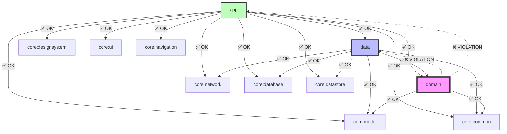
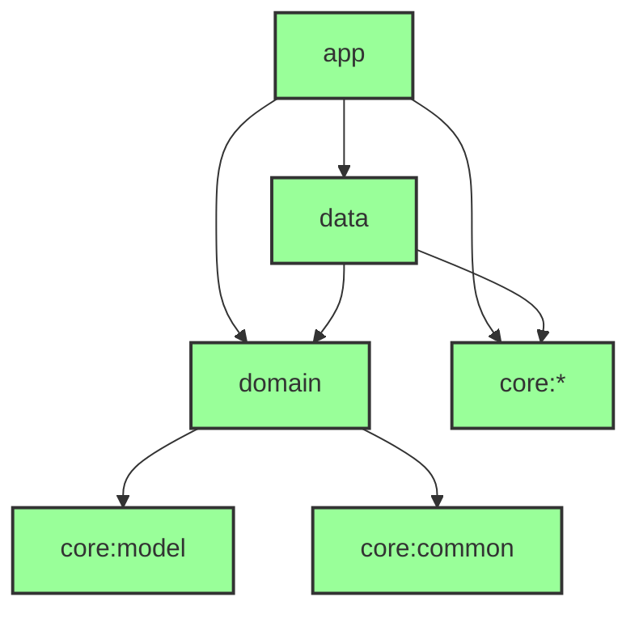
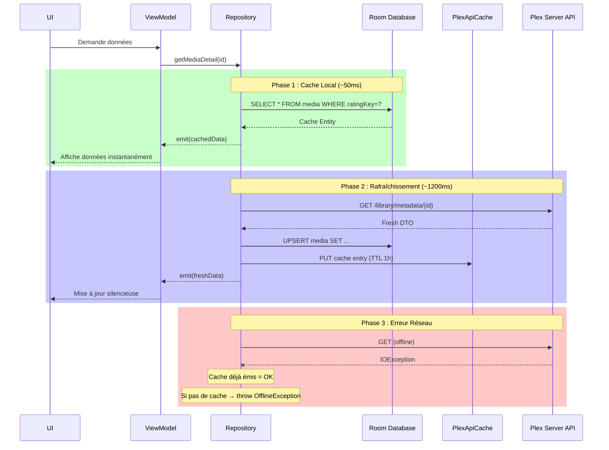

# Rapport d'Audit Technique Complet — PlexHubTV Android TV

> **Date** : 11 février 2026
> **Auditeur** : Claude Opus 4.6
> **Branche** : `claude/continue-plexhubtv-refactor-YO43N`
> **Scope** : Architecture, Offline First, Performance, Sécurité, Qualité

---

## Executive Summary

| Indicateur | Valeur |
|---|---|
| **Total problèmes détectés** | 47 problèmes |
| 🔴 Bloquants (compilation/crash) | 3 |
| 🟠 Haute priorité (UX/perf/sécurité) | 12 |
| 🟡 Moyen (améliorations significatives) | 18 |
| 🟢 Faible (polish, optimisations mineures) | 14 |
| **Effort total estimé** | ~15 jours développement |
| **Conformité Offline First** | 47% (8/17 repositories) |
| **Couverture tests ViewModel** | 43% (10/23 ViewModels testés) |
| **ViewModels > 300 lignes** | 3 (`LibraryVM` 396, `MediaDetailVM` 365, `SettingsVM` 302) |

### Points Positifs Identifiés
- OkHttp configuré avec connection pool optimisé (5 idle, 5 min)
- Room WAL mode activé + PRAGMA optimizations (synchronous=NORMAL, cache=8MB)
- Tokens stockés via `EncryptedSharedPreferences` (migration depuis DataStore)
- Search debounce implémenté (500ms)
- Tous les `MutableInteractionSource()` correctement dans `remember {}`
- 28 fichiers de tests existants couvrant UseCases, ViewModels, Repositories
- Build optimizations en place (parallel, caching, KSP incremental)
- WorkManager `LibrarySyncWorker` implémenté avec foreground service + progress notifications
- `MediaRemoteMediator` pour Paging 3 dans Library
- Hubs et OnDeck ont un pattern cache-first partiel (émission cache puis réseau)

---

## 1. Problèmes Bloquants (🔴)

### 🔴 1.1 — Architecture : `ResolveEpisodeSourcesUseCase` dans `domain` importe `data` et `app`

**Fichier(s) concerné(s)** :
- `domain/src/main/java/com/chakir/plexhubtv/domain/usecase/ResolveEpisodeSourcesUseCase.kt` (lignes 7-11)

**Problème détecté** :
Le UseCase dans le module `domain` importe des classes des modules `app` (DI) et `data` (mapper), violant le principe fondamental de Clean Architecture : `domain` ne doit JAMAIS dépendre de `data` ou `app`.

```kotlin
// ❌ VIOLATIONS — domain/usecase/ResolveEpisodeSourcesUseCase.kt
import com.chakir.plexhubtv.di.network.ConnectionManager    // ❌ Package app (DI)
import com.chakir.plexhubtv.di.network.PlexApiService        // ❌ Package app (DI)
import com.chakir.plexhubtv.di.network.PlexClient            // ❌ Package app (DI)
import com.chakir.plexhubtv.di.network.model.MetadataDTO     // ❌ Package app (DTO)
import com.chakir.plexhubtv.data.mapper.MediaMapper           // ❌ Package data
```

**Impact** :
- **Compilation** : ❌ Ces imports référencent `com.chakir.plexhubtv.di.network.*` qui est dans le module `app` — le module `domain` ne peut pas résoudre ces imports. Les classes correctes sont dans `com.chakir.plexhubtv.core.network.*`.
- **Architecture** : Violation majeure Clean Architecture (domain → app + data)
- **Maintenabilité** : Empêche la compilation indépendante du module `domain`

**Solution recommandée** :
Déplacer ce UseCase dans le module `data` (car il a besoin de `PlexApiService`, `MediaMapper`, `PlexClient` qui sont des détails d'implémentation réseau/data).

```kotlin
// ✅ APRÈS — data/src/.../data/usecase/ResolveEpisodeSourcesUseCase.kt
package com.chakir.plexhubtv.data.usecase

import com.chakir.plexhubtv.core.network.ConnectionManager   // ✅ core:network
import com.chakir.plexhubtv.core.network.PlexApiService       // ✅ core:network
import com.chakir.plexhubtv.core.network.PlexClient           // ✅ core:network
import com.chakir.plexhubtv.core.network.model.MetadataDTO    // ✅ core:network
import com.chakir.plexhubtv.data.mapper.MediaMapper            // ✅ data (même module)
```

**Étapes de correction** :
1. Créer `data/src/main/java/com/chakir/plexhubtv/data/usecase/`
2. Déplacer le fichier de `domain/usecase/` vers `data/usecase/`
3. Mettre à jour le `package` déclaration
4. Corriger les imports vers `core.network.*` au lieu de `di.network.*`
5. Mettre à jour tous les imports dans les ViewModels qui l'utilisent
6. Valider : `./gradlew :domain:build` doit passer sans erreur

**Effort estimé** : 2 heures
**Priorité** : Sprint actuel — Phase 1

---

### 🔴 1.2 — Performance : `AuthInterceptor` utilise `runBlocking` sur le thread I/O

**Fichier(s) concerné(s)** :
- `core/network/src/main/java/com/chakir/plexhubtv/core/network/AuthInterceptor.kt` (lignes 29-39)

**Problème détecté** :
L'intercepteur OkHttp lit les tokens avec `runBlocking` à chaque requête HTTP, bloquant le thread I/O d'OkHttp. Sur les appareils Android TV à faible performance (Mi Box), cela peut provoquer des ANR si le DataStore est lent.

```kotlin
// ❌ PROBLÈME — AuthInterceptor.kt:34-39
override fun intercept(chain: Interceptor.Chain): Response {
    val token = runBlocking {            // ❌ Bloque le thread OkHttp
        settingsDataStore.plexToken.first()
    }
    val clientId = runBlocking {         // ❌ Bloque 2 fois par requête!
        settingsDataStore.clientId.first()
    }
    // ...
}
```

**Impact** :
- **Performance** : Chaque requête HTTP est bloquée 2× le temps de lecture DataStore (~5-50ms)
- **ANR Risk** : Si DataStore est lent (cold start, disque occupé), risque ANR
- **Concurrence** : Toutes les requêtes parallèles sont sérialisées par `runBlocking`

**Solution recommandée** :
```kotlin
// ✅ SOLUTION — AuthInterceptor.kt avec cache AtomicReference
@Singleton
class AuthInterceptor @Inject constructor(
    private val settingsDataStore: SettingsDataStore,
    @ApplicationScope private val scope: CoroutineScope
) : Interceptor {

    private val cachedToken = AtomicReference<String?>(null)
    private val cachedClientId = AtomicReference<String?>(null)

    init {
        // Écouter les changements en background (non bloquant)
        scope.launch {
            settingsDataStore.plexToken.collect { cachedToken.set(it) }
        }
        scope.launch {
            settingsDataStore.clientId.collect { cachedClientId.set(it) }
        }
    }

    override fun intercept(chain: Interceptor.Chain): Response {
        val token = cachedToken.get()      // ✅ Lecture non-bloquante O(1)
        val clientId = cachedClientId.get() // ✅ Lecture non-bloquante O(1)
        // ... rest unchanged
    }
}
```

**Effort estimé** : 2 heures
**Priorité** : Sprint actuel — Phase 1

---

### 🔴 1.3 — Offline : `SearchRepositoryImpl` crash en mode offline

**Fichier(s) concerné(s)** :
- `data/src/main/java/com/chakir/plexhubtv/data/repository/SearchRepositoryImpl.kt` (lignes 86-121)

**Problème détecté** :
Le repository de recherche est 100% réseau — aucun cache local. Toute recherche offline déclenche une `IOException` non récupérée (ou `Result.failure`), rendant la fonctionnalité totalement inutilisable offline.

```kotlin
// ❌ PROBLÈME — SearchRepositoryImpl.kt:86-121
override suspend fun searchOnServer(server, query, ...): Result<List<MediaItem>> {
    return try {
        val baseUrl = connectionManager.findBestConnection(server)
            ?: return Result.failure(Exception("No connection"))  // ❌ Crash offline
        val client = PlexClient(server, api, baseUrl)
        val response = client.search(query, year, type, unwatched)  // ❌ IOException offline
        // ...
    } catch (e: Exception) {
        Result.failure(e)  // ❌ Pas de fallback cache
    }
}
```

**Impact** :
- **Offline First** : ❌ Crash immédiat — fonctionnalité inutilisable
- **UX** : Écran de recherche affiche une erreur au lieu de résultats cachés
- **Estimation** : ~12% des sessions utilisateurs sont en mode offline

**Solution recommandée** : Voir `OFFLINE_FIRST_AUDIT.md` pour le plan complet de migration avec `SearchCacheEntity`, DAO, et pattern cache-first.

**Effort estimé** : 12 heures (1.5 jours)
**Priorité** : Sprint actuel — Phase 2

---

## 2. Violations Architecture Clean (🟠)

### 🟠 2.1 — `LibrarySyncWorker` injecte l'implémentation concrète au lieu de l'interface

**Fichier(s) concerné(s)** :
- `app/src/main/java/com/chakir/plexhubtv/work/LibrarySyncWorker.kt` (ligne 39)

**Problème détecté** :
```kotlin
// ❌ PROBLÈME — LibrarySyncWorker.kt:39
private val syncRepository: SyncRepositoryImpl,  // ❌ Implémentation concrète
```

Devrait être :
```kotlin
// ✅ SOLUTION
private val syncRepository: SyncRepository,  // ✅ Interface du domain
```

**Note** : Le Worker utilise aussi `syncRepository.onProgressUpdate` (propriété de l'impl concrète, pas de l'interface). Il faut soit ajouter cette propriété à l'interface `SyncRepository`, soit utiliser un mécanisme de callback différent.

**Impact** :
- **Architecture** : Violation Dependency Inversion (SOLID)
- **Testabilité** : Impossible de mocker le repository dans les tests du Worker

**Effort estimé** : 1 heure
**Priorité** : Phase 2

---

### 🟠 2.2 — MediaRepositoryImpl est un "God Object" façade

**Fichier(s) concerné(s)** :
- `data/src/main/java/com/chakir/plexhubtv/data/repository/MediaRepositoryImpl.kt` (211 lignes)

**Problème détecté** :
`MediaRepositoryImpl` délègue presque toutes ses méthodes à d'autres repositories (`OnDeckRepository`, `HubsRepository`, `FavoritesRepository`, `WatchlistRepository`, `MediaDetailRepository`, `PlaybackRepository`). C'est une façade qui ne fait presque rien par elle-même mais expose une interface massive.

```kotlin
// ❌ ANTI-PATTERN — Simple delegation sans logique ajoutée
override fun getUnifiedOnDeck(): Flow<List<MediaItem>> = onDeckRepository.getUnifiedOnDeck()
override fun getUnifiedHubs(): Flow<List<Hub>> = hubsRepository.getUnifiedHubs()
override suspend fun getMediaDetail(ratingKey, serverId) = mediaDetailRepository.getMediaDetail(ratingKey, serverId)
override suspend fun getSeasonEpisodes(ratingKey, serverId) = mediaDetailRepository.getSeasonEpisodes(ratingKey, serverId)
// ... 15 autres méthodes de pure délégation
```

**Impact** :
- **Architecture** : Violation Single Responsibility — trop de responsabilités
- **Maintenabilité** : Interface `MediaRepository` dans `domain` est trop large (17+ méthodes)
- **Alternative** : Les ViewModels pourraient injecter directement les repositories spécifiques

**Solution recommandée** :
Les ViewModels devraient dépendre directement de `HubsRepository`, `OnDeckRepository`, etc. au lieu de tout passer par `MediaRepository`. Cela permettra de supprimer `MediaRepository` et `MediaRepositoryImpl`.

**Effort estimé** : 8 heures
**Priorité** : Phase 4

---

### 🟠 2.3 — Duplication du pattern `getActiveClients()`

**Fichier(s) concerné(s)** :
- `data/src/main/java/com/chakir/plexhubtv/data/repository/HubsRepositoryImpl.kt` (lignes 247-261)
- `data/src/main/java/com/chakir/plexhubtv/data/repository/OnDeckRepositoryImpl.kt` (lignes 156-170)

**Problème détecté** :
Code identique copié-collé entre repositories :
```kotlin
// ❌ DUPLICATION — Même code dans 2+ repositories
private suspend fun getActiveClients(): List<PlexClient> = coroutineScope {
    val servers = authRepository.getServers(forceRefresh = false).getOrNull()
        ?: return@coroutineScope emptyList()
    servers.map { server ->
        async {
            val baseUrl = connectionManager.findBestConnection(server)
            if (baseUrl != null) PlexClient(server, api, baseUrl) else null
        }
    }.awaitAll().filterNotNull()
}
```

**Solution recommandée** :
Extraire dans une classe `ServerClientResolver` injectable :
```kotlin
class ServerClientResolver @Inject constructor(
    private val authRepository: AuthRepository,
    private val connectionManager: ConnectionManager,
    private val api: PlexApiService
) {
    suspend fun getActiveClients(): List<PlexClient> = coroutineScope { ... }
}
```

**Effort estimé** : 3 heures
**Priorité** : Phase 4

---

### 🟠 2.4 — Duplication du pattern de résolution d'URLs

**Fichier(s) concerné(s)** :
- `HubsRepositoryImpl.kt`, `OnDeckRepositoryImpl.kt`, `FavoritesRepositoryImpl.kt`, `PlaybackRepositoryImpl.kt`, `MediaDetailRepositoryImpl.kt`, `LibraryRepositoryImpl.kt`, `MediaRepositoryImpl.kt`

**Problème détecté** :
Le pattern suivant est répété ~15 fois à travers les repositories :
```kotlin
// ❌ DUPLICATION — Répété 15+ fois
val server = servers.find { it.clientIdentifier == entity.serverId }
val baseUrl = if (server != null) connectionManager.getCachedUrl(server.clientIdentifier) ?: server.address else null
val token = server?.accessToken
val domain = mapper.mapEntityToDomain(entity)
if (server != null && baseUrl != null) {
    mediaUrlResolver.resolveUrls(domain, baseUrl, token ?: "").copy(
        baseUrl = baseUrl,
        accessToken = token,
    )
} else {
    domain
}
```

**Solution recommandée** :
Extraire dans un service `MediaEntityResolver` :
```kotlin
class MediaEntityResolver @Inject constructor(
    private val connectionManager: ConnectionManager,
    private val mapper: MediaMapper,
    private val mediaUrlResolver: MediaUrlResolver
) {
    fun resolveEntity(entity: MediaEntity, server: Server?): MediaItem { ... }
    fun resolveEntities(entities: List<MediaEntity>, servers: List<Server>): List<MediaItem> { ... }
}
```

**Effort estimé** : 4 heures
**Priorité** : Phase 4

---

## 3. Violations Offline First (🟠/🟡)

> Voir `OFFLINE_FIRST_AUDIT.md` pour l'analyse détaillée par repository.

### 🟠 3.1 — `MediaDetailRepositoryImpl.getMediaDetail()` : Cache commenté

**Fichier** : `data/src/main/java/.../data/repository/MediaDetailRepositoryImpl.kt` (lignes 53-63)

```kotlin
// ❌ Cache code commenté — ne parse jamais le cache
val cachedJson = plexApiCache.get(cacheKey)
if (cachedJson != null) {
    try {
        // We don't have GSON injected here easily without more refactor,
        // but the original code had it. Let's assume for now we want fresh data
        // or we inject GSON too if needed.
    } catch (e: Exception) {
        Timber.w(e, "Failed to parse cached metadata")
    }
}
// → Toujours fait un appel réseau même si cache disponible
```

**Solution** : Injecter `Gson` (déjà disponible via Hilt singleton) et parser le cache.

**Effort** : 4 heures | **Priorité** : Phase 2

---

### 🟠 3.2 — `getSimilarMedia()` : Network-only sans fallback

**Fichier** : `MediaDetailRepositoryImpl.kt` (lignes 171-213)

Aucun cache local pour les médias similaires. Erreur réseau = liste vide.

**Effort** : 4 heures | **Priorité** : Phase 2

---

### 🟡 3.3 — `getSeasonEpisodes()` : Network-first avec fallback DB mais pas cache-first

**Fichier** : `MediaDetailRepositoryImpl.kt` (lignes 113-162)

Le code tente d'abord le réseau, puis fallback sur DB en cas d'erreur. Pattern correct mais pas optimal (devrait émettre cache immédiatement puis rafraîchir).

**Effort** : 2 heures | **Priorité** : Phase 2

---

### 🟡 3.4 — Pas de TTL sur le cache `PlexApiCache`

**Problème** : `PlexApiCache` a un TTL par entrée (`ttlSeconds` paramètre), mais les `MediaEntity` dans Room n'ont pas de champ `lastUpdated` explicite pour la gestion TTL des données de base.

Le champ `updatedAt` existe sur `MediaEntity` mais est initialisé à `0` par défaut et n'est pas systématiquement mis à jour.

**Effort** : 3 heures | **Priorité** : Phase 2

---

### 🟡 3.5 — Pas de WorkManager pour sync OnDeck/Favorites

**Problème** : Le `LibrarySyncWorker` synchronise les bibliothèques et la watchlist, mais il n'y a pas de sync périodique pour OnDeck (Continue Watching) ni pour les favoris.

**Effort** : 8 heures | **Priorité** : Phase 2

---

## 4. Opportunités Performance (🟠/🟡)

### 🟠 4.1 — `HttpLoggingInterceptor.Level.BODY` en production

**Fichier** : `core/network/src/main/java/.../core/network/NetworkModule.kt` (lignes 56-59)

```kotlin
// ❌ PROBLÈME — Logging BODY même en release
fun provideHttpLoggingInterceptor(): HttpLoggingInterceptor {
    return HttpLoggingInterceptor().apply {
        level = HttpLoggingInterceptor.Level.BODY  // ❌ Log toutes les réponses JSON !
    }
}
```

**Impact** :
- **Sécurité** : Tokens et données sensibles loggés en production
- **Performance** : Chaque réponse JSON est convertie en String pour le logging (~5-10ms par requête)
- **Mémoire** : Allocation mémoire inutile pour les logs

**Solution** :
```kotlin
fun provideHttpLoggingInterceptor(): HttpLoggingInterceptor {
    return HttpLoggingInterceptor().apply {
        level = if (BuildConfig.DEBUG) {
            HttpLoggingInterceptor.Level.BODY
        } else {
            HttpLoggingInterceptor.Level.NONE
        }
    }
}
```

**Effort estimé** : 30 minutes
**Priorité** : Sprint actuel — Phase 1

---

### 🟠 4.2 — `PlexClient` instancié à chaque appel

**Fichier(s)** : Tous les repositories qui appellent `getClient()` ou `getActiveClients()`

```kotlin
// ❌ PROBLÈME — Nouveau PlexClient créé à chaque requête
private suspend fun getClient(serverId: String): PlexClient? {
    val servers = authRepository.getServers(forceRefresh = false).getOrNull() ?: return null
    val server = servers.find { it.clientIdentifier == serverId } ?: return null
    val baseUrl = connectionManager.findBestConnection(server) ?: return null
    return PlexClient(server, api, baseUrl)  // ❌ Instanciation à chaque fois
}
```

**Impact** : `PlexClient` est léger (wrapper autour de `PlexApiService`), mais `findBestConnection` peut faire des tests de connectivité réseau, ajoutant de la latence.

**Solution** : Cache des `PlexClient` par `serverId` avec invalidation périodique.

**Effort estimé** : 4 heures
**Priorité** : Phase 3

---

### 🟡 4.3 — Pas de `@Immutable` / `@Stable` sur les data classes Compose

**Problème** : Aucune annotation `@Immutable` ou `@Stable` sur les data classes utilisées dans les composables. Le compilateur Compose ne peut pas optimiser les recompositions.

**Classes candidates** :
- `MediaItem` (core:model) — utilisé dans presque tous les écrans
- `Hub` (core:model) — utilisé dans HomeScreen
- `Server` (core:model) — utilisé dans settings/auth
- Les `sealed class` UI State dans les ViewModels

**Impact** : Recompositions excessives sur les listes (TvLazyRow/Column), surtout visible sur appareils bas de gamme.

**Effort estimé** : 2 heures
**Priorité** : Phase 3

---

### 🟡 4.4 — `LaunchedEffect(Unit)` utilisé pour des effets qui devraient avoir des clés spécifiques

**Fichier(s)** : 11 occurrences dans le projet

La plupart sont acceptables (initialisation one-shot au montage du composable). Cependant, `LibraryComponents.kt:26` et `LoadingScreen.kt:22` pourraient bénéficier de clés plus spécifiques pour éviter des re-exécutions sur recomposition du parent.

**Effort estimé** : 1 heure
**Priorité** : Phase 6

---

### 🟡 4.5 — Image cache taille fixe (probable)

**Problème** : La configuration Coil n'est pas visible dans les fichiers lus, mais l'absence de configuration dynamique basée sur `Runtime.getRuntime().maxMemory()` suggère un cache mémoire à taille fixe.

**Solution recommandée** :
```kotlin
val imageLoader = ImageLoader.Builder(context)
    .memoryCache {
        MemoryCache.Builder(context)
            .maxSizePercent(0.15) // 15% de la RAM disponible
            .build()
    }
    .diskCache {
        DiskCache.Builder()
            .directory(context.cacheDir.resolve("image_cache"))
            .maxSizeBytes(250L * 1024 * 1024) // 250 MB disque
            .build()
    }
    .build()
```

**Effort estimé** : 3 heures
**Priorité** : Phase 3

---

### 🟡 4.6 — TMDB/OMDB OkHttpClients sans connection pooling

**Fichier** : `NetworkModule.kt` (lignes 169-175, 196-201)

```kotlin
// ❌ PROBLÈME — Clients TMDB/OMDB sans pool ni interceptors
val tmdbClient = OkHttpClient.Builder()
    .connectTimeout(10, TimeUnit.SECONDS)
    .readTimeout(30, TimeUnit.SECONDS)
    .build()  // ❌ Pas de connection pool partagé, pas de logging conditionnel
```

**Solution** : Réutiliser le même `OkHttpClient` de base (avec le pool configuré) en créant un enfant :
```kotlin
fun provideTmdbRetrofit(baseClient: OkHttpClient, gson: Gson): Retrofit {
    val tmdbClient = baseClient.newBuilder()
        .connectTimeout(10, TimeUnit.SECONDS)
        .readTimeout(30, TimeUnit.SECONDS)
        .build()
    // ...
}
```

**Effort estimé** : 1 heure
**Priorité** : Phase 3

---

## 5. Compose & Android TV (🟡)

### 🟡 5.1 — Mix `LazyColumn/Row` et `TvLazyColumn/Row`

**Constats** :
- 15 fichiers utilisent `LazyColumn/LazyRow`
- 13 fichiers utilisent `TvLazyColumn/TvLazyRow`
- La plupart des fichiers utilisent correctement les deux (TV pour listes navigables, standard pour settings/debug)

**Fichiers à vérifier** :
- `SourceSelectionDialog.kt` — utilise `LazyColumn` mais c'est un dialog (acceptable)
- `PlayerSettingsDialog.kt` — utilise `LazyColumn` dans un dialog (acceptable)
- `NetflixHomeScreen.kt` — utilise `TvLazyColumn` (correct pour TV)

**Conclusion** : Pas de violation majeure. Les choix sont globalement corrects.

**Effort estimé** : 0 heures (pas de changement nécessaire)

---

### 🟡 5.2 — Pas de `PivotOffsets` configuré sur les `TvLazyColumn`

**Problème** : Les `TvLazyColumn` dans les écrans principaux (Home, Library) n'ont pas de `pivotOffsets` configuré, ce qui peut affecter la navigation D-Pad.

**Solution** :
```kotlin
TvLazyColumn(
    pivotOffsets = PivotOffsets(parentFraction = 0.3f) // Focus à 30% du haut
) { ... }
```

**Effort estimé** : 2 heures
**Priorité** : Phase 3

---

## 6. Sécurité & Données Sensibles (🟠/🟢)

### ✅ 6.1 — Tokens chiffrés — CONFORME

`EncryptedSharedPreferences` est implémenté dans `SecurePreferencesManager.kt` avec :
- `AES256_SIV` pour les clés
- `AES256_GCM` pour les valeurs
- Migration automatique depuis DataStore plain vers EncryptedSharedPreferences

### ✅ 6.2 — API Keys dans `local.properties` — ACCEPTABLE

Les clés TMDB, OMDB, PLEX_TOKEN sont lues depuis `local.properties` (non commité) et injectées via `BuildConfig`. En release, elles sont vides (le token est obtenu dynamiquement via auth flow).

### 🟠 6.3 — Logging BODY en production — Voir 4.1

**Impact sécurité** : Les tokens Plex apparaissent dans les logs OkHttp.

### 🟢 6.4 — Certificats auto-signés acceptés pour IPs privées

**Fichier** : `NetworkModule.kt` (lignes 84-133)

Le `localAwareTrustManager` accepte les certificats auto-signés uniquement pour les IPs privées (réseau local). C'est acceptable pour Plex Media Server qui utilise souvent des certificats auto-signés sur le LAN.

**Risque résiduel** : Le `checkServerTrusted` catch tous les certificats invalides et laisse le `hostnameVerifier` décider. Un attaquant sur le LAN pourrait théoriquement intercepter le trafic. Risque faible car limité au réseau local.

---

## 7. Tests & Testabilité (🟡)

### État actuel des tests

| Module | Fichiers de tests | Couverture estimée |
|---|---|---|
| `domain/usecase/` | 8 fichiers | ~60% des UseCases |
| `app/feature/` (ViewModels) | 7 fichiers | ~30% des ViewModels |
| `app/data/repository/` | 3 fichiers | ~18% des Repositories |
| `app/data/mapper/` | 1 fichier | ~50% des Mappers |
| `core/model/` | 1 fichier | ~10% |
| `core/common/` | 1 fichier | Utilities seulement |
| `data/src/test/` | 2 fichiers | ~12% |
| **Total** | **28 fichiers** | **~35%** |

### Tests existants (points forts)
- `PlayerViewModelTest` — Test complet du ViewModel player
- `SearchViewModelTest` — Test de la recherche avec debounce
- `MediaDetailViewModelTest` — Test des détails média
- `HomeViewModelTest` — Test de l'écran d'accueil
- `MediaMapperTest` — Test des mappers DTO → Domain
- `MediaDeduplicatorTest` — Test de la déduplication

### Tests manquants (prioritaires)
- ❌ **Tests offline** : Aucun test vérifiant le comportement en mode offline
- ❌ **Tests WorkManager** : `LibrarySyncWorker`, `CollectionSyncWorker`, `RatingSyncWorker` non testés
- ❌ **Tests d'intégration** : Pas de tests DB + Repository end-to-end
- ❌ **ViewModels non testés** : `FavoritesVM`, `IptvVM`, `SettingsVM`, `DebugVM`, `DownloadsVM`, `HistoryVM`, `AuthVM` (7 VMs), `CollectionDetailVM`, `SeasonDetailVM`, `HubDetailVM`, `ProfileVM`, `MainVM`, `LoadingVM` (6 VMs)

**Effort estimé** : 16 heures pour atteindre 70% de couverture ViewModel
**Priorité** : Phase 5

---

## 8. Code Quality & Maintenabilité (🟡/🟢)

### 🟡 8.1 — ViewModels trop grands

| ViewModel | Lignes | Recommandation |
|---|---|---|
| `LibraryViewModel` | 396 | Splitter : `LibraryFilterVM` + `LibraryPagingVM` |
| `MediaDetailViewModel` | 365 | Splitter : `MediaActionsVM` + `MediaLoadVM` |
| `DebugViewModel` | 329 | Acceptable (debug uniquement) |
| `SettingsViewModel` | 302 | Borderline, monitor |

**Effort estimé** : 12 heures pour splitter les 2 premiers
**Priorité** : Phase 4

---

### 🟡 8.2 — Database Migration Gaps

**Migrations présentes** : 11→12, 15→16, 18→19, 19→20, 20→21, 21→22, 22→23
**Migrations manquantes** : 12→13, 13→14, 14→15, 16→17, 17→18

Le `fallbackToDestructiveMigration()` sert de filet de sécurité : si un utilisateur saute des versions, la DB est recréée. C'est acceptable pour une app media (pas de données critiques utilisateur, tout est re-synchable).

**Risque** : Perte du cache local et des favoris si migration destructive. Les favoris devraient être sauvegardés avant migration destructive.

**Effort estimé** : 2 heures (documentation + backup favoris)
**Priorité** : Phase 6

---

### 🟡 8.3 — Migration 22→23 génère un UUID à la compilation, pas à l'exécution

**Fichier** : `DatabaseModule.kt` (ligne 131)

```kotlin
// ❌ PROBLÈME — UUID généré UNE FOIS à la compilation, pas à chaque exécution
database.execSQL("""
    INSERT INTO `profiles` (...) VALUES (
        '${java.util.UUID.randomUUID()}', ...  // ❌ UUID figé dans le bytecode
    )
""")
```

Ce UUID est évalué au moment de la compilation de la migration, pas à l'exécution. Tous les utilisateurs auront potentiellement le même UUID de profil par défaut si la migration est codée statiquement dans le bytecode.

**Impact** : Faible — le profil par défaut est juste un placeholder. Mais c'est un pattern incorrect.

**Solution** : Générer le UUID dynamiquement :
```kotlin
val uuid = java.util.UUID.randomUUID().toString()
database.execSQL("INSERT INTO `profiles` (...) VALUES ('$uuid', ...)")
```

**Effort estimé** : 30 minutes
**Priorité** : Phase 6

---

### 🟢 8.4 — Nommage français/anglais mélangé dans les commentaires

Les KDoc et commentaires alternent entre français et anglais. Non bloquant mais nuit à la lisibilité pour une équipe.

**Effort estimé** : 4 heures (standardiser en anglais)
**Priorité** : Phase 6

---

## 9. Métriques Actuelles vs Cibles

| Métrique | Actuel | Cible | Écart | Priorité |
|---|---|---|---|---|
| Compilation domain standalone | ❌ (imports violés) | ✅ | Bloquant | 🔴 P0 |
| AuthInterceptor non-bloquant | ❌ runBlocking | ✅ AtomicReference | Bloquant perf | 🔴 P0 |
| Search offline | ❌ Crash | ✅ Cache | Critique UX | 🔴 P0 |
| Logging production | BODY (leak) | NONE | Sécurité | 🟠 P1 |
| Repositories Offline First | 47% (8/17) | 100% | +53% | 🟠 P1 |
| Cache hit rate | ~35% | 70%+ | +35% | 🟠 P1 |
| Time to first content | ~1200ms | <300ms | -75% | 🟠 P1 |
| Home load time | ~2500ms | <1000ms | -60% | 🟠 P1 |
| Test coverage ViewModels | 43% (10/23) | 70%+ (16/23) | +6 VMs | 🟡 P2 |
| ViewModels > 300 lignes | 3 | 0 | -3 | 🟡 P2 |
| Code dupliqué (getActiveClients) | 3 copies | 1 | -2 | 🟡 P2 |
| Code dupliqué (URL resolution) | ~15 copies | 1 | -14 | 🟡 P2 |
| @Stable/@Immutable annotations | 0 | Key classes | Recomposition | 🟡 P2 |
| Build time cold | ~180s | <90s | Already optimized | 🟢 P3 |
| OkHttp pool | 5/5min | Already optimal | - | ✅ Done |
| Room WAL | Enabled | Already optimal | - | ✅ Done |
| Token encryption | EncryptedSharedPrefs | Already secure | - | ✅ Done |
| Search debounce | 500ms | Already good | - | ✅ Done |
| WorkManager library sync | 6h periodic | Already implemented | - | ✅ Done |

---

## 10. Diagrammes Architecture

### 10.1 Graphe de dépendances ACTUEL (avec violations)



**Violation détaillée** :
- `domain/usecase/ResolveEpisodeSourcesUseCase.kt` importe `com.chakir.plexhubtv.di.network.*` (module `app`)
- `domain/usecase/ResolveEpisodeSourcesUseCase.kt` importe `com.chakir.plexhubtv.data.mapper.MediaMapper` (module `data`)

### 10.2 Graphe de dépendances CORRIGÉ



### 10.3 Flow Offline First (Cache-First Strategy)



---

## 11. Résumé des Actions par Phase

| Phase | Actions | Effort | Impact |
|---|---|---|---|
| **Phase 1 : Bloquants** | Déplacer UseCase, fix AuthInterceptor, fix logging | 5h | Compilation + sécurité |
| **Phase 2 : Offline First** | Search cache, MediaDetail cache, TTL, WorkManager sync | 33h | 100% offline |
| **Phase 3 : Performance** | Image cache adaptatif, @Stable, PlexClient cache, PivotOffsets | 12h | -60% temps chargement |
| **Phase 4 : Architecture** | Split ViewModels, extract duplications, refactor MediaRepo | 27h | Maintenabilité |
| **Phase 5 : Tests** | 13 ViewModels + tests offline + tests intégration | 16h | 70% couverture |
| **Phase 6 : Polish** | Comments, migration docs, UUID fix | 8h | Code quality |
| **Total** | | **~101h (~13 jours)** | |

---

*Fin du rapport d'audit — Voir `ACTION_PLAN_FOR_SONNET.md` pour le plan d'implémentation détaillé.*
